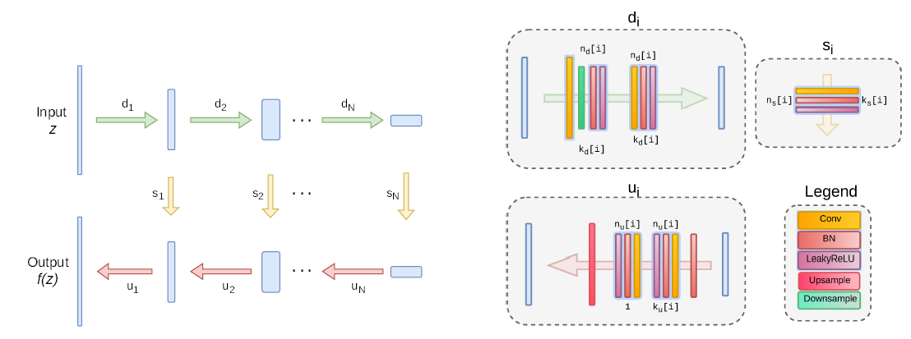
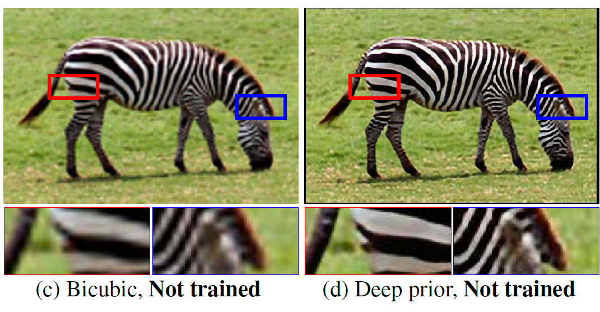

##  Deep Image Prior(2018)

> - #  ***概要***  
>   CNNを用いて、
その特性によって画像データのデノイズや補完を行う手法についての論文です。画像の圧縮などによって生じた不明な劣化を修正することができ、自然な画像については最適化が速く進み、自然でない（シャッフルされたもの、ノイズ）については不活性な性質を持つことが検証されています。 
>   　画像の劣化課程を知ったり事前学習したりする必要なく補完できる。
> - **CNN**  
>   ネットワークは、1)ダウンサンプリング, 2)スキップコネクション, 3)アップサンプリングの3つの部分から成り立っており(Fig 1)、最適化に平均二乗誤差を用いています。。超解像の際には、出力をダウンサンプリングしてから元画像と誤差関数で比較します。また、インペイントを解消する場合、バイナリマスクによって差分との要素積をとってから誤差関数に入力する。これにより書き込みのない部分だけで評価しています。
>   
Figure 1: Deep Image Prior アーキテクチャの構造
>

>
> - **実験結果の概要**
>   - 超解像について、バイキュービック法と比較すると明らかに高解像度化に成功していることがわかった(Fig 2)。
>   

Figure 2: バイキュービック法, Deep Image Priorの比較

>

>
>   - インペインティングについては、テキストを挿入した画像、ベルヌーイ分布によるマスクをした画像、白い巨大な抜け落ちのある画像を基にほかの手法との比較を行い、いずれも高い再現性を示している。
> 
> 　
>  

> - #  ***疑問点のリスト***  
>   - 畳み込みの性質によって線などの構造をとらえ、自然な画像が構成できることは感覚的にはわかるのですが、理論がよくわかりません。
>   - "degradation process"(劣化課程 9448右)についての言及がどういうことをさしているのか。劣化原因に依存せずに高解像度にできるということ？

> - # ***論文に対する批判・改善案***　 
>   - 完全なランダムの画像データから元の画像に近づけていますが、残しておきたい部分のエッジなどを乗せたらさらに高画質になる、もしくは少ない学習や変数での補完ができるのではないかと考えました。
>   - 一般的な誤算関数の平均二乗誤差を用いていますが、どうしてそれを使っているのか根拠が少し気になりました（ほかの関数との比較などをした結果なのかどうか）。 
